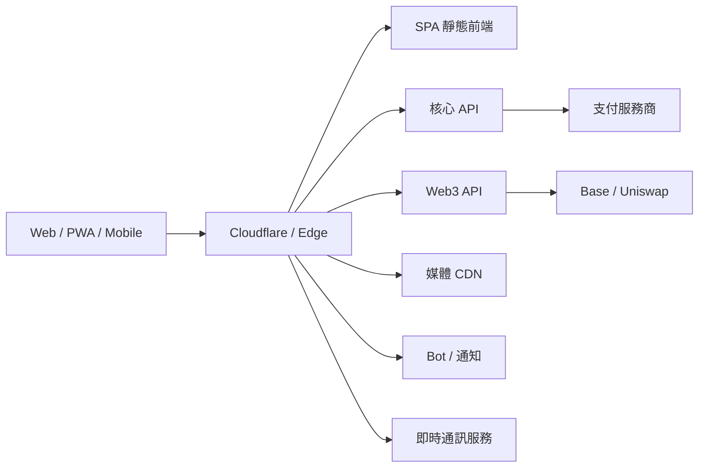
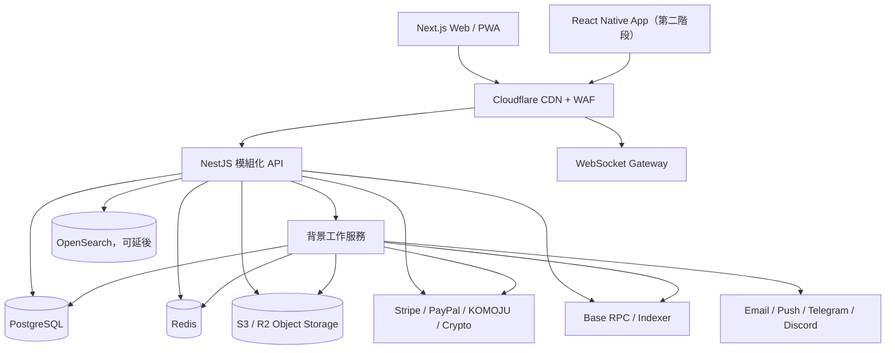
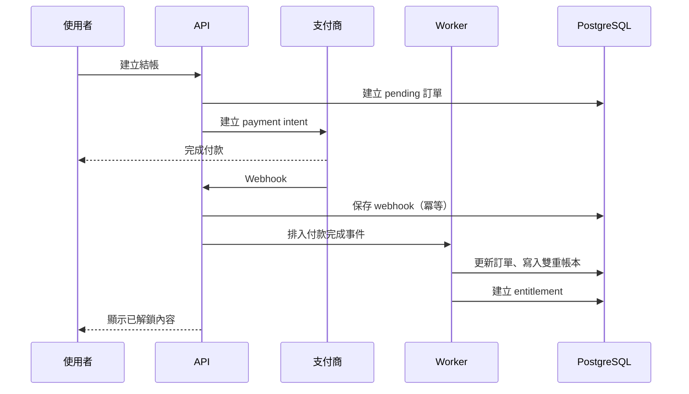

# PeroHub 類社交創作者平台：架構分析與開發計畫

> 分析日期：2026-06-22  
> 分析範圍：PeroHub 公開頁面、前端公開資源及未登入狀態可見流程。登入後的完整創作、購買、聊天、提現與管理後台流程無法直接驗證，因此相關內容分為「已觀察」與「建議實作」。

## 1. 產品定位

PeroHub 並非一般純社交動態平台，而是由四個核心系統組成：

1. **內容社交系統**：作品、創作者、關注、搜尋、頻道、應援團。
2. **創作者商業系統**：月費訂閱、數位單品、付費往期內容、創作者認證。
3. **平台金融系統**：多支付渠道、平台錢包、返利、分潤、提現與交易帳本。
4. **Web3 延伸系統**：錢包、PERO 空投、創作者代幣、Base 鏈與 Uniswap 相關功能。

最接近的產品組合是：

- Patreon / Fanbox：訂閱支持與分級內容
- Gumroad：數位單品
- Discord / Telegram：社群與通知
- X / Instagram：關注、動態與作品曝光
- 錢包 / DEX：鏈上資產與創作者代幣

## 2. 已觀察到的功能

### 2.1 訪客與粉絲端

- 搜尋作品、使用者與頻道
- 關注創作者
- 瀏覽頻道
- 瀏覽及加入「應援團」
- 購買數位內容
- 按月訂閱創作者
- 付費解鎖往期內容
- 推薦創作者或使用者，取得返利
- 平台錢包及 Web3 錢包入口

### 2.2 創作者端

- 創作者註冊與原創認證
- 發布圖文、圖片、影片等內容
- 建立訂閱方案
- 發售數位單品
- 設定付費可見內容
- 圖片防盜浮水印
- 查看收入與交易
- 提現，包括公開頁面宣稱的 USDT 提現
- 被推薦入駐後的推薦分潤

### 2.3 平台營運

- 使用者、內容與交易管理
- 舉報中心
- 版權及違規內容處理
- 創作者認證
- 推薦返利規則
- 支付、退款、結算與提現
- 廣告位或推廣入口
- 18+ 使用限制

### 2.4 推薦／返利

公開頁面顯示：

- 消費者綁定推薦人後，每次消費雙方各取得 0.5%。
- 認證創作者有推薦人時，推薦人取得其銷售額 1% 的額外獎勵。

推薦系統必須建在不可變更的交易帳本之上，不能只在訂單表加一個 `commission` 欄位。

### 2.5 Web3

- 建立或連接錢包
- PERO 空投
- 創作者原創認證作為資格條件
- 創作者代幣
- Base 鏈瀏覽器連結
- Uniswap 流動性或交易入口

建議 Web3 作為獨立有界模組，不要讓鏈上交易直接控制核心內容權限。鏈上狀態應先經確認、索引及風控，再映射到平台權益。

## 3. 公開技術架構線索

從公開前端資源可辨識：

- Vue 類型 SPA，並提供 PWA manifest
- Cloudflare 作為公開入口
- 主站 API：`api.perohub.com`
- Web3 API：`web3.api.perohub.com`
- CDN：`cdn.perohub.com`
- Bot API：`bot.api.perohub.com`
- RTC：`rtc.renderer.perohub.com`
- Stripe 前端 SDK
- PayPal、KOMOJU 等支付相關資源
- Telegram Web App、Telegram Bot、Discord OAuth
- Base、Basescan、Uniswap 相關整合

合理推斷其邏輯架構如下，但無法由公開頁面確認實際後端語言、資料庫或部署方式：



## 4. 建議目標架構

### 4.1 架構原則

- 第一版採用**模組化單體**，不要過早微服務化。
- 支付、帳本、媒體處理、通知和鏈上索引使用非同步任務。
- PostgreSQL 是交易與關聯資料的唯一真實來源。
- Redis 只用於快取、限流、短期狀態與工作佇列。
- 物件儲存保存原始媒體及衍生檔，CDN 對外分發。
- 搜尋初期用 PostgreSQL Full Text / Trigram，規模增加後再導入 OpenSearch。
- Web3 與法幣支付使用獨立 adapter，避免第三方供應商侵入核心業務模型。



## 5. 建議技術選型

### 前端

- Web：Next.js 15+、React、TypeScript
- UI：Tailwind CSS + Headless UI / Radix UI
- Server state：TanStack Query
- Client state：Zustand
- 表單：React Hook Form + Zod
- 編輯器：TipTap
- 圖片上傳：分段直傳 S3/R2
- 即時功能：WebSocket / Socket.IO client
- 國際化：next-intl
- 測試：Vitest、Testing Library、Playwright

選擇 Next.js 的原因是作品、頻道及創作者頁需要 SEO、Open Graph、分享預覽與較佳首屏速度。若團隊已有成熟 Vue 經驗，可改用 Nuxt 3，整體架構不變。

### 後端

- API：NestJS + TypeScript
- API 風格：REST 為主；即時事件使用 WebSocket
- ORM：Prisma 或 Drizzle
- 任務佇列：BullMQ + Redis
- 驗證：短效 access token + rotation refresh token
- 媒體：FFmpeg、Sharp
- API 文件：OpenAPI
- 觀測：OpenTelemetry + Sentry + Grafana
- 測試：Jest/Vitest、Supertest、Testcontainers

### 資料與基礎設施

- PostgreSQL 16+
- Redis 7+
- Cloudflare R2 或 AWS S3
- Cloudflare CDN、WAF、Turnstile
- OpenSearch（搜尋量足夠後再加入）
- Docker；初期使用託管容器服務
- GitHub Actions CI/CD
- Terraform 管理正式環境

## 6. 後端模組

| 模組 | 職責 |
|---|---|
| Identity | 註冊、登入、OAuth、2FA、session、裝置 |
| User/Profile | 個人資料、創作者頁、隱私設定 |
| Creator | 創作者申請、認證、風險狀態 |
| Social Graph | 關注、封鎖、收藏、按讚 |
| Content | 作品、貼文、草稿、標籤、可見性 |
| Media | 上傳、掃毒、轉碼、縮圖、浮水印 |
| Channel | 頻道、分類、策展、排序 |
| Circle | 應援團、成員、角色、團內內容 |
| Comment | 留言、回覆、reaction、審核 |
| Subscription | 方案、訂閱、升降級、續費 |
| Commerce | 數位商品、購物、訂單、退款 |
| Entitlement | 使用者目前有權查看或下載的內容 |
| Payment | 支付意圖、webhook、支付渠道 adapter |
| Ledger | 平台雙重記帳、餘額、分潤、返利 |
| Payout | KYC、提現、審批、渠道狀態 |
| Affiliate | 推薦綁定、歸因、佣金規則 |
| Notification | 站內、Email、Push、Telegram、Discord |
| Search | 作品、使用者、頻道索引 |
| Moderation | 舉報、審核、處罰、申訴、版權 |
| Web3 | 錢包、簽名、鏈上交易、代幣、索引 |
| Admin | 營運後台、風控、財務對帳、稽核 |

## 7. 前端頁面與功能

### 公開與粉絲端

- 首頁／推薦動態
- Following 動態
- 搜尋結果：作品、使用者、頻道
- 作品詳情
- 創作者主頁
- 頻道列表與詳情
- 應援團列表與詳情
- 方案選擇與訂閱結帳
- 數位商品結帳與下載
- 收藏、按讚、留言、分享
- 通知中心
- 訂閱與訂單管理
- 錢包、返利與交易明細
- 舉報及申訴

### 創作者工作台

- 數據總覽
- 作品／貼文編輯器
- 媒體管理
- 訂閱方案管理
- 數位商品管理
- 訂閱者管理
- 收入、帳本及提現
- 推薦計畫
- 創作者認證
- 頻道／應援團管理
- Web3 設定（後期）

### 管理後台

- 使用者及創作者管理
- 認證審核
- 內容與舉報隊列
- 訂單、退款、拒付
- 帳本、提現及對帳
- 推薦佣金
- 頻道和首頁策展
- 系統配置、功能開關
- 管理員角色與稽核日誌

## 8. 核心資料庫設計

### 8.1 身分與社交

- `users`
- `user_profiles`
- `auth_identities`
- `sessions`
- `creator_profiles`
- `creator_verifications`
- `follows`
- `blocks`
- `user_roles`

`follows` 唯一鍵為 `(follower_id, followee_id)`；禁止自己關注自己。

### 8.2 內容

- `posts`
- `post_versions`
- `media_assets`
- `post_media`
- `tags`
- `post_tags`
- `comments`
- `comment_reactions`
- `likes`
- `bookmarks`
- `channels`
- `channel_posts`

`posts` 建議包含：

- `author_id`
- `type`
- `title`
- `body_json`
- `status`
- `visibility`
- `published_at`
- `adult_rating`
- `moderation_status`

不要在貼文表直接存一個簡單 `is_paid`；付費權限應由 entitlement 規則計算。

### 8.3 社群

- `circles`
- `circle_members`
- `circle_roles`
- `circle_posts`
- `circle_join_requests`

### 8.4 訂閱與商品

- `membership_plans`
- `subscriptions`
- `subscription_events`
- `products`
- `product_files`
- `orders`
- `order_items`
- `refunds`
- `entitlements`
- `downloads`

`entitlements` 是權限核心，可記錄：

- 權限持有人
- 權限來源：訂閱／單次購買／贈送／管理員
- 資源類型及 ID
- 生效與失效時間
- 是否撤銷

### 8.5 支付、帳本與提現

- `payment_customers`
- `payment_methods`
- `payment_intents`
- `payment_transactions`
- `payment_webhook_events`
- `ledger_accounts`
- `ledger_transactions`
- `ledger_entries`
- `balances`
- `payout_accounts`
- `payouts`
- `payout_events`
- `chargebacks`

每筆資金異動應產生至少兩筆 `ledger_entries`，借貸合計必須為零。支付 webhook 必須以供應商事件 ID 做冪等處理。

### 8.6 推薦

- `referral_codes`
- `referral_bindings`
- `affiliate_rules`
- `affiliate_attributions`
- `affiliate_commissions`

佣金先進入 `pending`，待退款／拒付窗口結束後才轉為 `available`。

### 8.7 治理

- `reports`
- `report_evidence`
- `moderation_cases`
- `moderation_actions`
- `appeals`
- `copyright_claims`
- `audit_logs`

### 8.8 Web3

- `wallets`
- `wallet_nonces`
- `chain_transactions`
- `token_contracts`
- `creator_tokens`
- `token_balances_cache`
- `airdrop_campaigns`
- `airdrop_claims`
- `chain_events`

私鑰原則上不應由平台資料庫保存。若提供託管錢包，應使用專業 MPC／嵌入式錢包供應商。

## 9. 關鍵 API

```text
POST   /auth/register
POST   /auth/login
POST   /auth/refresh
GET    /users/:handle
POST   /users/:id/follow

GET    /feed
GET    /posts/:id
POST   /creator/posts
PATCH  /creator/posts/:id
POST   /uploads/presign

GET    /channels
GET    /channels/:slug
GET    /circles
POST   /circles/:id/join

GET    /creators/:id/plans
POST   /subscriptions/checkout
POST   /orders/checkout
GET    /me/entitlements

POST   /payments/webhooks/:provider
GET    /me/wallet
GET    /me/ledger
POST   /payouts

POST   /referrals/bind
GET    /me/referrals

POST   /reports
GET    /admin/moderation/cases
POST   /admin/moderation/cases/:id/actions

POST   /web3/wallet/challenge
POST   /web3/wallet/verify
GET    /web3/tokens
POST   /web3/airdrops/:id/claim
```

## 10. 主要流程

### 10.1 付費解鎖



### 10.2 媒體發布

1. 前端向 API 申請一次性上傳 URL。
2. 原始檔直接上傳物件儲存。
3. Worker 掃毒、檢查格式與 NSFW／違規風險。
4. 圖片生成縮圖與個人化浮水印版本；影片進行轉碼。
5. 寫入媒體狀態。
6. 內容審核通過後發布。

個人化浮水印若需要包含購買者 ID，不應為每個使用者永久生成整套圖片；可在下載／閱覽時由邊緣服務動態疊加短識別碼。

## 11. 非功能需求

### 安全

- 密碼使用 Argon2id
- 2FA、登入裝置管理
- OAuth state / PKCE
- CSRF、XSS、SSRF 防護
- 上傳 MIME 與檔案簽名雙重檢查
- API rate limit 及機器人防護
- 支付 webhook 簽章驗證
- 所有財務與管理操作寫入 audit log
- 私密媒體使用短效 signed URL
- 資料加密與 secrets manager

### 財務正確性

- 金額用最小貨幣單位整數，不用浮點數
- 每種貨幣獨立帳戶
- 支付、退款、拒付、佣金、提現均有狀態機
- 每日供應商對帳
- webhook、工作任務及鏈上事件均須冪等

### 效能

- 首頁與公開內容 CDN 快取
- Feed 採 cursor pagination
- 熱門計數器使用 Redis，週期性落庫
- 圖片使用 WebP/AVIF
- 大型影片分段上傳及 HLS
- 慢查詢監控與索引審計

### 合規

- 18+ 門檻及內容分級
- KYC／AML：創作者提現及加密貨幣功能
- DMCA／版權投訴
- GDPR／CCPA 資料匯出及刪除
- 支付商可接受內容政策
- 稅務文件與創作者收入報表
- 不同國家／地區的內容與支付可用性控制

## 12. 分階段開發計畫

### Phase 0：產品定義與風險驗證（2–3 週）

- 定義市場、地區、成人內容政策
- 確認支付商是否接受平台內容類型
- 確認創作者 KYC、稅務及提現方案
- 完成 UX flow、資料模型與 threat model
- 建立設計系統、CI/CD 和環境

交付：PRD、原型、架構決策紀錄、ERD、API 草案、合規清單。

### Phase 1：社交內容 MVP（6–8 週）

前端：

- 註冊登入
- 個人／創作者主頁
- 發布圖文與圖片
- 首頁 feed
- 關注、按讚、收藏、留言
- 搜尋

後端：

- Identity、User、Creator、Content、Media、Social Graph
- 基礎審核與舉報
- Email／站內通知

資料庫：

- 使用者、內容、媒體、關注、互動、舉報核心表

### Phase 2：訂閱與數位商品（6–8 週）

- 會員方案
- 月費訂閱
- 單次購買
- 權限 entitlement
- 訂單與支付 webhook
- 創作者收入頁
- 私密媒體 signed URL
- 浮水印
- 退款基礎流程

這是最重要的商業閉環，完成前不建議投入 Web3。

### Phase 3：錢包、分潤與提現（4–6 週）

- 雙重記帳帳本
- 平台餘額
- 推薦綁定與佣金
- 創作者提現
- KYC
- 退款、拒付與每日對帳
- 財務管理後台

### Phase 4：頻道、應援團與即時互動（5–7 週）

- 頻道策展
- 應援團與角色
- 圈內貼文
- 即時通知
- 私訊或群聊（如確有產品需要）
- Telegram／Discord Bot

### Phase 5：Web3（6–10 週）

- 錢包簽名登入／綁定
- Base 鏈事件索引
- 空投
- 創作者代幣
- Uniswap 交易／流動性入口
- 鏈上風控與管理後台

Web3 合約必須另行進行安全審計，不能僅依靠一般後端測試。

### Phase 6：擴展與 App（持續）

- React Native App
- Push notification
- OpenSearch
- Feed ranking
- 推薦系統
- 多地區部署
- 數據倉庫與 BI

## 13. 時程與團隊估算

### 可商用 MVP

範圍：Phase 0–3，不包含完整 Web3 和即時聊天。

- 時間：約 5–7 個月
- 團隊：
  - 1 產品經理
  - 1 UI/UX
  - 2 前端
  - 2–3 後端
  - 1 QA
  - 0.5 DevOps/SRE
  - 兼職法務／支付合規

### 完整平台

範圍：Phase 0–5。

- 時間：約 8–12 個月
- 需增加：
  - 1 Web3 工程師
  - 智能合約審計預算
  - 內容安全與財務營運人員

估算會受支付接入、KYC、成人內容政策、影片功能及 App 商店政策顯著影響。

## 14. MVP 優先級

### P0

- 使用者／創作者帳號
- 發布與瀏覽作品
- 關注與搜尋
- 訂閱方案
- 數位商品
- 支付、entitlement
- 創作者收入與提現
- 舉報、管理後台

### P1

- 評論、收藏、通知
- 推薦返利
- 頻道
- 應援團
- 浮水印
- Telegram／Discord

### P2

- 私訊／群聊
- 複雜 feed 推薦
- 原生 App
- 創作者代幣、空投、DEX

## 15. 主要風險

1. **支付風險**：UGC、成人內容與跨境支付容易造成支付商拒絕、凍結和高拒付率。
2. **帳務風險**：訂閱、退款、分潤、佣金與多幣種若沒有雙重帳本，很難正確對帳。
3. **內容治理**：版權、未成年人內容、非法內容及地區限制需要人工與自動化共同處理。
4. **媒體成本**：高畫質圖片和影片的儲存、流量、轉碼成本可能高於 API 成本。
5. **Web3 風險**：合約漏洞、價格操縱、監管與私鑰管理會顯著擴大攻擊面。
6. **功能過載**：社交、商店、訂閱、聊天、錢包、DeFi 同時開發會拖慢商業閉環。

建議先證明「創作者發布 → 粉絲付費 → 平台分帳 → 創作者提現」這條路徑，再擴展社群與 Web3。

